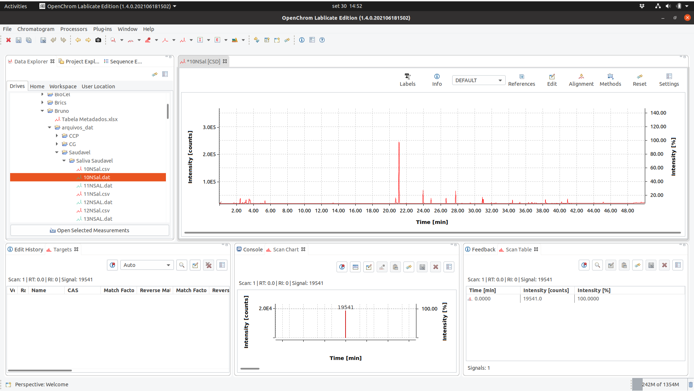

## GC-FID 
[](http://colab.research.google.com/github/computational-chemical-biology/gc-fid/blob/master/explore_FID_data.ipynb)

This repository uses [MALDIquant](https://cran.r-project.org/web/packages/MALDIquant/index.html) to process two-dimensional GC-FID data. The repository is also companion material for the [publication](http://doi.org/10.1088/1752-7163/acb284).

To convert the `.dat` spectra, [OpenChrom](https://lablicate.com/platform/openchrom) is used.



Open on 

To install the conda env:

```
conda env create -f environment.yml
```
To update the env:

```
conda env export | grep -v "^prefix: " > environment.yml
```
